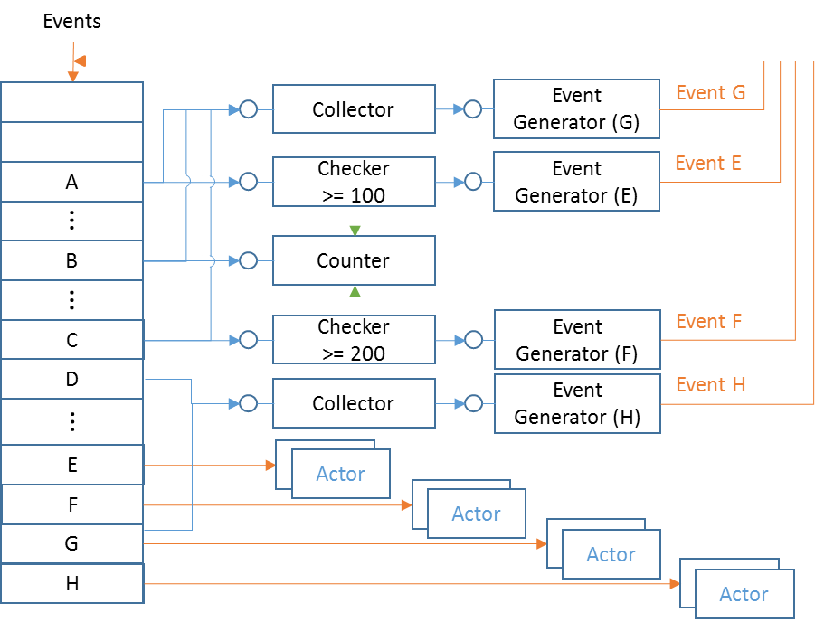

**Rule Engine** is used in many projects. Basically we define rules, apply rules into rule engine. Then when events come, the rule engine will process events based on rules, generate decision and send to actors.


## Simple Rule vs Complex Rule 

**Simple Rule** refers to rules that will make decision directly by one event.

Example of **Simple Rule**:
- `If process "Notepad.exe" accessing Internet, block it`
- `If one executable in temporary folder start running, alert user.`

These rule engine cannot handle complex rule like
- `If process "Notepad.exe" write a file to disk, and later the file start run, then alert user`

Here the rule need track multiple events, and delay decision making based on complex relations between events. We call them **Complex Rule**

Be able to process **Complex Rule** is required in many real-life cases.

## Traditional Solution

**State Machine** is traditional method to handle **Complex Rule**. When a event matched one rule, it will start a state machine to track the case. The state machine keep watching for new interested events, transfer from one state to another, make decision when reach the end state.

For the rule `If process "Notepad.exe" write a file to disk, and later the file start run, then alert user` as example.


- On event `FileCreationEvent`, state machine will transfer to state **1** if the file creator is "Notepad.exe". State machine will start monitor interested events.
- Later when a `ProcessStartEvent` come, the state machine will compare the process executable file, if it match the one "Notepad.exe" created, it will transfer to the end state and make decision (trigger the alert)

The state machine need remember previously created file path. And whenever Notepad.exe created one file, a new state machine instance need be created to track it. For almost all of them, they will never executable, so each state machine will wait forever. We will have too much dead objects in memory.

Also, many rules has special requirements, the traditional "**state machine**" solution become complicate, cannot cover all requirements.

For example, for rule `If eventA happen more than 10 times, alert and report.`, besides the `on event transfer state` logic, the state machine need maintain a counter. 

Another example, for rule `If eventA happened, report it, but do not report duplicated events within one hour`, state machine need implement more state transfer conditions.

## Primitive solution 

In software engineering, usually we want to design a generic function trying handle various input. Why not let the input modify the function? or let input even create the function!

Still take the example rule above. The logic flow is


If we replace it with some generic **primitive**, it equals to this:


If we input this graph into the rule engine as instruction and let rule engine assembly primitives according to the graph, we will get a engine dynamically to handle the rule. The rule logic become the connections between primitives.

The basic idea is, **split complex process into low level generic and simple processes (primitives), each small primitive will generate an internal event (or even can output if anybody want). We implement complex processing by assemble multiple primitives together**. 

## Example 1 

Implement rule
```console
If event A happened and event B counted at least 100, then trigger event E
```

There are actually two different meanings for this rule: 

1. When event **A** happens, check whether event **B** counted more than 100, trigger event **E** if does. Order does matter here, only fire **E** if **A** happened after **B** reach 100 times. 

2. Any time both two conditions "*event A happened*" and "*event B counted more than 100*" are true, trigger event **E**. Order does not matter here. This means we need save signal of event **A**, so when event **B** reach the condition we can grab the event **A** status and fire event **E**. 

#### Example 1.1 

For the first meaning, we can assemble primitives like: 


Blue line means signal trigger; Yellow line means event; Green line means `Check`. 

When an event comes, we look up an `event dictionary` based on the event name, trigger signals registered on that event. 
The `event dictionary` also save registered actors list. 

* When event **B** happens, it triggers signal to a `Counter`, which will keep counting event **B**. 
* When event **A** happens, it triggers signal to a `Checker`, which will check `Counter` and output signal if `count > 100`. 
* The triggered signal of `Checker` connected to an `Event Generator` which will generate event **E** and feed back to the events processing. 
* Then all `Actors` registered on event **E** will be called. 

Every primitive contains one **SignalReceiver** and one **SignalSender**. Primitive send signal through the **SignalSender** and accept signal from **SignalReceiver**. "**A signal triggered**" means the **SignalSender** will go through its target list and call `Trigger` function of each in list, with parameters saved along with the function pointer (delegate for C#). 

The parameters of `Trigger` function is defined by each primitive type. For the `Counter` as example, it will accept one parameter: `Increase`, `Decrease` or `Reset`. Parameters can be defined statically on the design time, or can be determine dynamically during runtime if it start with `#MACRO#`. 

**SignalSender** also supports function `TargetPaused()` and `TargetResumed()`. Signal targets call them to inform signal source it doesn't want to receive new signals (although it doesn't hurt if continue calling it, but we don't want to waste resource). Signal source can optionally release resource for better performance. For example the [`TimerSource`](#TimerSource) primitive can stop its system timer if all its targets are paused, to save system resource. 

Besides the normal **SignalSender**, some primitive can has secondary **SignalSender**. It will send signal on normal **SignalSender** if certain condition is true, and send signal to the second **SignalSender** if condition is false. We call this
secondary SignalSender "**Negative**" sender. 

Refer "[**Primitives Reference**](#Primitives+Reference)" section for detail on all supported primitives. 

#### Example 1.2 

For the second meaning of the rule, we need change primitives layout to this: 


A new primitive `Collector` is introduced here. `Collector` will collect signals, trigger output signal only if collected all input signals. It maintains slots internally and mark one slot true if a signal received for that slot. Its **SignalReceiver** needs a parameter so it can know which slot hit. 

When event **A** happens, the signal will be saved in the `Collector` slot 0, whenever **B** happens, we use a `CountdownCounter` which start with 100 and saved to the `Collector` slot 1 when it count down to 0. Whenever two conditions both true (both slots filled), we will publish event **E**, and reset the counter. 

## Example 2 

Keep the rule of **Example 1.1**, further implement rule
```console
If event C happened and event B counted at least 200, then trigger event F
```
Let's also follow the first meaning which is simpler. 

After combine two rules, the final result is. 


We are sharing same `Counter` here. 

One request is, how can we reset counter whenever new event fired? Since the counter is shared by two rules, we cannot simply reset it. We can design `Checker` to be "*auto roll-over*" mode, which means it will increase its barrier every time it fired. For example the first checker (>=100) will automatically adjust its condition to (>=200) after the first firing; the second checker (>=200) will update to (>=400) after its first firing. 

It is arguable whether it is worthy sharing a single basic counter, since all it does is increasing an integer. In case we need a "key based counter" (for example, count on each registry key being accessed), it's efficient to have a single shared primitive. 

## Example 3 

Keep all rules in **Example 2**, further implement rule
```console
If event A, B and C are all happened, trigger event G
```


A `Collector` will fulfill this job. 

## Example 4 

Keep all rules in **Example 3**, further implement rule
```console
If event A, B, C and D are all happened, trigger event H
```

There are two ways to design this, we can either implement the rule as is:   


Or, we noticed that we already have a rule for event **G**, and the new rule is equals to `If event G and D are all happened, trigger event H`. We can reuse event **G** this way. The collector of event H only collect event **D** and **G**, don't care about **A**, **B**, **C**.



After we create all rules, we will make a big picture with all kinds of primitives connected together and output all possible complex events. 

## A Real Example 

Here is one known requirement from one security product. 

Whenever one file is blocked/quarantined, we need report to backend. But we don't want to send report too frequently, which will generate too much traffic  and increase CPU usage. So we need one aggregator, and the requirement is: 

* If there is new **block** event and we did not report for long time (say one minute), report it right away. 
* If we already sent report recently, hold new coming **block** events for one minute. 
* Do not report if there is no new file blocked. 
  


Whenever a file is blocked, an event `FileBlocked` will be created and feed into rule engine. 

If it already passed 60 seconds, the `Counter` should stopped and `Collector` already hold one signal, once received the new **block** signal, it will fire new **Report** event right away. 

Whenever the new event generated, the counter will be reset and start again. The collector also auto-reset. 

When a "**block**" event come and we've already reported within 60 seconds, the `Counter` did not stop yet, so we will wait for timeout and fire report. 

If counter timeout but there is no "**block**" event, counter will stop and nothing will report. 

## Logic Operations 

It is expected that many rules will involve "**NOT**" "**AND**" "**OR**" logic. 

For "**AND**" operation, the engine workflow already naturally represent such logic: following primitives will not be triggered unless previous primitives triggered. In case we need "**AND**" different event source, we can use a `collector`, which trigger output only if all inputs are true. 

Both "**NOT**" and "**OR**" can be implemented by introduce concept of "***conditional output***" in some primitive, such as "**StringFilter**" and "**Checker**". Usually these primitives will check some condition and decide triggering output or keeping silence. We can change them to have two outputs, trigger the "***Positive***" output if the condition is true and trigger "***Negative***" output if the condition is false. 

So for "**NOT**" logic, we just connect the next primitive onto the "***Negative***" output of such conditional primitive. 

For "**OR**" logic, it usually can be represent with `if … else…`. For example: `If (A or B) then C` can be represent as `if A then C, else if B then C`. This can be graph as:


Some primitive internally provide "**OR**" operations. For examples if we want to implement `if string equals A or B or C`, we can use "**MatchList**" mode of [`StringFilter`](#StringFilter) and put strings "A" "B" and "C" inside the target list. 

For combinational logic, we need first simplify it by "**Boolean Algebra**". For example 

- "**!(A | B)**" should be "**!A & !B**"
- "**!(A & B)**" should be "**!A | !B**" 
- "**(A & B) | (A & C)**" should be "**A & (B | C)**"

## Rule Language 

We need define a way to translate rule to this model. Developer design rules and describe them with this "**language**", Rule Engine parses this language and create correct primitives and connect them together to form the engine.

***One rule is a description on how to generate one certain complex event***. 

The rule focus on event generation, does not specify how the generated event be consumed. Event consumer can register to rule engine to get called back. 

There are several elements when describe a rule: 

- What event it will final generate. 
-  What event or multiple events it starts with 
- What kind of processes it required to generate final event, in step by step. 

With these information, we can define a rule with JSON. 

The rule in **Example 1.2** can be written in JSON as: 

```json
{
    "Rules": [
        {
            "RuleName": "Example1.2",
            "SourceEvents": [
                {
                    "EventName": "A",
                    "ConnectTo": {
                        "Collector_1": {
                            "SignalParameter":0
                        }
                    }
                },
                {
                    "EventName": "B",
                    "ConnectTo": {
                        "Counter_1": {}
                    }
                },
                {
                    "EventName": "E",
                    "ConnectTo": {
                        "Counter_1": {
                            "SignalParameter": 0
                        }
                    }
                }
            ],
            "Primitives": [
                {
                    "Type": "Collector",
                    "Name": "Collector_1",
                    "Parameters" : { "SourceCount": 2 },
                    "ConnectTo": { "EventGenerator_1" : {} }
                },
                {
                    "Type":"CountdownCounter",
                    "Name":"Counter_1",
                    "Parameters" : { "StartFrom": 100 },
                    "ConnectTo": {
                        "Collector_1" : { "SignalParameter":1 }
                    }
                },
                {
                    "Type":"EventGenerator",
                    "Name":"EventGenerator_1",
                    "Parameters" : { "NewEventName":"E" }
                }
            ],
        }
    ]
}
```
  
One rule contains `name`, one `SourceEvents` section and one `Primitives` section. 

### `SourceEvents` Section

The `SourceEvents` list source events this rule based, and specify primitives it connects to. 

The `EventName` specify the event it based. 

`ConnectTo` is a dictionary of primitive names it connects to. For each primitive connected to, we can specify the signal parameter, either single or an array. 

### `Primitives` Section

The `Primitives` list primitives used by this rule. 

For each primitive, we need specify its type and give it a name which should be unique inside this rule. Primitives refer each other by name. 

Many primitive need configuration parameters, we specify those with `Parameters` which is a "`name : value`" dictionary. 

`ConnectTo` is a dictionary of primitive names it connects to. For each primitive connected to, we can specify the signal parameter, either single or an array. 

This JSON file contains only one rule, we can add more rules by increasing the "Rules" array. 

For conditional primitive, we can connect to the next primitive through the "**Negative**" signal sender. We will add attribute `"TriggerOnNegative" : true`. For example 

```json
"ConnectTo": {
    "Collector_1": {
        "SignalParameter": 1,
        "TriggerOnNegative": true
  }
}
```

## Rule Loading 

Once received a JSON stream, the parser inside "**Rule Engine**" will process rules inside it, one by one, create primitives and connect them. 

When creating one primitive, we need determine whether we can share exist one, so we need detect if two primitives are the same. 

**If two primitives are of same type and with same configuration parameters, has same set of signal sources and signal parameters, then these two primitive will always in same state and output same signals at same time, so they are same.** 

One requirement here is signal sources must be same. This requires that when we trying to create one primitive, all signal sources of it must be already settled down. This means: for the directed graph formed by primitives, we need process them in **topological order**. 

To topological sort directed graph, the graph cannot contain circle (DAG). In normal cases there should not be circle in our logic (ignore the event send back by the `EventGenerator` since they do not affect primitives order). We should give up sharing primitives if one rule does has circle, or treat the circle part as a single primitive thus removed circle (match all primitives in a circle as whole). 

This is workflow we processing a rule: 

- Create nodes for each source event and primitive, connect them by the `ConnectTo` indications, forms a directed graph. Because when we compare two `Checker`, we need compare the `CheckerTarget` to determine if they check same thing. This means the `CheckTarget` should be settled down before matching `Checker`. So we also add edges from `CheckTarget` to `Checker` on the graph. 

- Do topological sorting on the graph. 

- When processing a node, we need refer to its "**signal sources**", so we reverse connections in graph. 

- Start from the first node, with each node, go to the first "**signal source**" node of it, get the "**signal target**" list, compare each one with current node. 

  - If found one match (same type and configuration parameters), compare all "**signal sources**" between the matched one and current node, if they point to same "**signal sources**" with same signal parameters, save the matched one pointer (reference) in current node, this primitive is settled down. 

  - Otherwise, create new primitive, setup, connect with "**Signal Sources**". 

- Finish after processed all nodes. 

## Rule Deleting 

Deleting one rule means deleting one complex event from rule engine. We will dereference every primitives used by the rule and delete primitives if no other rule sharing it. 

1. Delete the `Actors` list for the event in `event dictionary`

2. Delete "**signal targets**" of this event with `Reset` parameter, these are rule internal signals. 

3. If the event to be deleted has other "**signal targets**" in event dictionary, that means this event is used as source of other complex event, we cannot delete anything before deleting the other rule. Stop. 

4. Put the `EventGenerator` primitive of the event into queue. (We will keep a list of `EventGenerator` for all event). 

5. For each primitive in queue: 

   - If its "**Signal Target**" list is not empty, or it is `ICheckable` primitive and its reference is not zero, skip this primitive. 

   - Disconnect from all "**Signal Source**" of this primitive. Put the signal source primitive in queue 

   - Dereference `CheckTarget` if current primitive is a `Checker`. Put the `CheckTarget` primitive into queue. 

   -  Delete current primitive 

1. After we removed signal target for one source event in event dictionary. If the source event has no other signal targets and has no actors specified, and there is `EventGenerator` defined for it. This means it is a "**pending to be deleted**" rule (see step 3), and now we can delete it. Recursively call this function to delete it. 

## Interfaces 

### Class `RuleEngine` 

This class define the whole engine, it provide methods 

- **`AddRule`**  
  Accept one JSON stream as input, create rules and merge into big picture. See "[**Rule Loading**](#Rule+Loading)" section for detail algorithm. 

- **`DeleteRule`**  
  Input is the complex event Id, delete primitives used by the rule. See "[**Rule Deleting**](#Rule+Deleting)" section for detail algorithm. 

- **`RegisterActor`**  
  Input are an event id and an actor reference (callback function pointer or delegate). Rule engine will put it into event dictionary, call the actor when the event generated. We can assign "**priority**" for each actor, actor with higher priority will be put into head of list. 

- **`ProcessEvent`**  
  Input is the source event. Process new event and possible trigger actors. Note that actors might be triggered before this function returns. 

### Interface `IEvent` 

Events can came from different sources with different data structure. As long as it implement this generic interface, it can be feed into rule engine and got processed. 

The definition of one "**Event**" is: **one object with one name and multiple "properties"**. So `IEvent` need provide event name and properties. To save run time for event implementation, we avoid comparing properties name string. Instead, rule engine will pre-retrieve property ID for each properties it might need (can be determined by rules definitions). The property ID is an integer, event developer decide how to map it to the property. When rule engine need a property, it will call `IEvent` function by integer ID. 

---
 ```csharp
 String EventName { get; }
 ```  

Rule engine get name of input events from this property. Event name describes the nature of "**what happened**", usually involves a category and one action, for example "**Process_Created**", "**Registry_Write**"… Event implementation can construct name from different data source. There is no spec on what the name looks like. In case it comply with the name defined in rule, rule engine will happy to use it. 

---
```csharp
IEvent CreateInstance(string eventName);
```  
Rule engine need this function to create a new complex event. 

---
```csharp
int GetPropertyId(string propertyName);
```  
During parsing rules, rule engine will call this function on a "**meta event object**" to map property names specified in rule into integer IDs. Later rule engine will use ID to grab property values from real events. 

---
```csharp
Object GetProperty(int propertyId);
```  
Rule engine call this function on input events to get property values. 

---
```csharp
Void SetProperty(int propertyId, object value);
```  
  When generating new complex events, after calling `CreateInstance` to get the new event object, rule engine use this function to fill properties inside it. 

### Internal Interface `IPrimitive`

---
```csharp
bool Setup(Dictionary<String,Object> parameters);
```  
Setup one primitive with configuration parameters 

---
```csharp
bool SameParameters(Dictionary<String,Object> parameters);
```  
Check if current primitive has same configuration `parameters` as input. This helps to determine if we can share same primitive between rules. 

### Internal Class `SignalSource` 

Each primitive which can send signal out will contains one or two (for negative output) `SignalSource` as "**signal sender**". 

---
```csharp
void ConnectTo(SignalTarget target, Object parameter);
```  
Add one `SignalTarget` in the target list, with signal parameters. The `parameter` can be a single parameter or a list of parameters, also can contain "**macro**". `SignalSource` will parse and pass parameters to the target when trigger signals. This function also call the target to setup reverse `SignalSource` link inside the target. 

---
```csharp
void DisconnectFrom(SignalTarget target);
```  
Disconnect from one `SignalTarget` 

---
```csharp
void Trigger(object context);
```  
 Send signal to connected targets, with the current context object. 

---
```csharp
void TargetPaused(SignalTarget target);
```  
`SignalTarget` call this function to inform signal source that the target doesn't want new signals. 

---
 ```csharp
 void TargetResumed(SignalTarget target);
 ```  
`SignalTarget`  inform signal source that the target want new signals again. 

### Internal Class `SignalTarget` 

Each primitive which can be triggered will contain one `SignalTarget` as "**Signal Receiver**". Primitive register delegate to `SignalTarget` and receive signal from it. 

---
```csharp
void ConnectFrom(SignalSource source);
```  
Inform that one `SignalSource` is connected to this target. This function should save source pointers for later query. 

---
```csharp
void DisconnectFrom(SignalSource source);
```  
Disconnect from one `SignalSource` 

---
```csharp
void Trigger(Object parameter, object context);
```  
Trigger signal with parameter and current context. It will call the owner primitive to process the signal. 

---
```csharp
void Pause()
```  
Owner primitive calls this function to inform that it does not want new signals. 

---
```csharp
void Resume()
```  
Owner primitive calls this function to inform that it want signals again. 

### Interface `ICheckable` 

---
 ```csharp
 Object Check(Object key);
 ```  
Return current internal value, optional accept a key parameter for "**Keyed**" primitives. 

## Deployment 

Rule engine is designed as a final class. It can be instantiated by anybody. There is no limitation that only one rule engine can exist in whole project. Each product can create its own rule engines for different filtering purpose. 

Signals between primitives are not platform message, they are simply function calls (delegate in C#). This will make it most lightweight and fast as needed, but this also means one rule engine instance cannot cross multiple processes. In case we need aggregate multiple events from different processes, we can create a rule engine on the platform message hub. Products wrap events into message, send to message hub (remote process), message hub feed events into its rule engine. When new event generated, message hub registered actor will wrap the new event into message and send to subscribers. 

To share rule engine between products within same process, the platform can provide a function like `GetRuleEngine`, which returns one singleton object (create one if not yet). 

It is not designed especially for certain program language, can be implemented in C/C++. For time critical use cases, it can provide real-time reaction. It only allocate new primitives when necessary so is pretty lightweight. 

Rule engine can also be used as "**event dispatcher**" without defining any rule inside. Just register actors on events, it will dispatch incoming events by `events dictionary`. 

## Other Details 

### Keyed Filtering 

Example rule:
```console
Alert if any registry key was written more than 500 times.
```

We should not simply count all registry keys with a single `Counter`. Since primitives are defined in design time, we cannot dynamically create counters for each accessed key, and it is resource wasting. So the solution is, introduce a "**keyed**" concept for certain primitives. For example `KeyedCounter`, `KeyedCollector`…

In these primitive, we internally maintain a dictionary on the key property, and separate processing of them internally. For this example, we use a `KeyedCounter` with the registry key path string as the key. Internally the `keypath -> count` map count on each appearing keys. 

### Context Aware Events 

Example rule:
```console
Alert if a file is created by notepad and start run
```

We have two events: "**File created**" and "**Script Run**". We want to match them by event context "**file path**", only alert if this two events belong same context (same file path). 

Keyed filtering is also the rescue in this case. With a `KeyedCollector` which collect these two type of events and internally associate them by the key "**file path**", we can solve the problem. 

### Carry Original Evidence 

After processing events, when generate new complex event, we need carry some properties from original event. 

Primitives should focus on basic logic it designed for, without caring about events details. So we use "**context**" concept. When we send signal to one primitive, we pass a "**context**" to the target primitive. The target primitive don't know what's inside it, it just pass it to the next primitive as is when trigger signal. 

Some primitives has multiple signal source. For example collector send out signal after collected multiple input signals (and multiple source contexts). These primitive will create a list and put all original contexts inside the list and pass the list as new context to the next primitive. 

On the start point, dispatcher will simply use the input event as the context. 

Rule designer should know clearly on how context passed and what are inside each context, so can write correct **macro** to retrieve properties from it. 

Please refer to the "[Context Change](#Context+Change)" part of each primitive reference. 

### Dynamic Signal Parameters 

In most cases, primitive need process data which dynamically retrieved from current context. For example `StringFilter` need filter on certain event property. Instead of hardcode data in rule, we need a way to specify the dynamic value. 

We can use concept like "**macro**". For example when we design rule, we can use string "`#MACRO#Context.Event.KeyPath`" to specify the parameter send to `StringFilter`, which means: Current context is one event, retrieve the event property `KeyPath` and use the value as parameter to `StringFilter`. 

The `#MACRO#` is the keyword to distinguish with hardcoded string parameters. 

Currently the supported macros are: 

- **`"#MACRO#Context.Event.<property name>"`**  
  Current context is one event. We want to use the value of property `<property name>` inside it. 

- **`"#MACRO#Contexts[n].Event.<property name>"`**  
  Current context is a list of events (like after a collector). We want the index `n` event from the list and use the value of its property `<property name>`. If the current context is result from multiple layers of collectors, we will use `Contexts[m][n]` to access the value, while `m` index the last layer of list and `n` index previous layer. 

- **`"#MACRO#Contexts[n]"`**  
  Current context is a list, and the index `n` object will contains the value we want.  Sometimes primitive want to output something, in case other primitive might interested on it. It will put the value into context list. For example [`Accumulator`](#Accumulator) will put its really accumulated value as the first element in the output list context.

## Primitives Reference

---
### `Accumulator`

Accumulate on input signal, each signal contains certain value number. Output signal when the total number reach or exceed the threshold. 

##### Configuration Parameters

- **`Threshold`**  
Integer. The number on which we output signal and restart. 

- **`Timeout`**  
Integer, in seconds. Optional. Timeout for each input. The value number carried by the expired item will be deducted from the total number. 

##### Signal Parameters

- String `"Reset"`  
Reset current accumulated number to 0, delete all saved items. 

- Integer `value`  
number to be added onto the accumulation. 

These two parameters are mutual-exclusive, signal sender can only use one parameter. 

##### Context Change

This primitive will save all input context. When output, the new context is a list of objects. The first object is the current accumulated number in integer, following with all saved input contexts. 

##### Example

Rule: 
*On event "**RegistryWrite**", if key path is "**path_1**", we give it score 20; if key path is "**path_2**", we give it score 30. We need alert "**RegistryAlert**" if total scores accumulated to 60.* 


  
```json
{
    "RuleName" : "AlertRegistryWrite",
    "Description" : "On event \"RegistryWrite\", if key path is \"path_1\", we give it score 20; if key path is \"path_2\", we give it score 30. We need alert \"RegistryAlert\" if total scores accumulated to 60",
    "SourceEvents" :
    [
        {
            "EventName" : "RegistryWrite",
            "ConnectTo" : { 
                "MatchPath1" : { "SignalParameter":"#MACRO#Context.Event.KeyPath" }
            }
        }
    ],
    "Primitives":
    [
        {
            "Type" : "StringFilter",
            "Name" : "MatchPath1",
            "Parameters" : {
                "Method" : "MatchSingle",
                "Condition" : "Equals",
                "MatchTo" : "path_1"
            },
            "ConnectTo" : {
                "AccumulateScore" : { "SignalParameter" : 20 }
            }
        },
        {
            "Type" : "StringFilter",
            "Name" : "MatchPath2",
            "Parameters" : {
                "Method" : "MatchSingle",
                "Condition" : "Equals",
                "MatchTo" : "path_2"
            },
            "ConnectTo" : {
                "AccumulateScore" : { "SignalParameter" : 30 }
            }
        },
        {
            "Type" : "Accumulator",
            "Name" : "AccumulateScore",
            "Parameters" : { "Threshold" : 60 },
            "ConnectTo" : { "EventGenerator_1" : {} }
        },
        {
            "Type" : "EventGenerator",
            "Name" : "EventGenerator_1",
            "Parameters" : {
                "NewEventName" : "RegistryAlert",
                "Properties" : {
                    "Score" : "#MACRO#Contexts[0]"
                }
            }
        }
    ]
}
```

<br />

---
### `BasicCounter` 

Count on input signals, 1 for each, continue forever (until reset). Do not output, but is checkable. 

##### Configuration Parameters 

None 

##### Signal Parameters 

- Integer 1. Increase count by 1 
- Integer -1. Decrease count by 1 
- Integer 0. Reset count to 0 

##### Context Change 

Since this primitive does not output signal, it does not care about context. 

##### Example 

Rule: 
*If event "**B**" happens and event "**A**" happened more than 100 times, fire event "**E**"* 


```json
{
    "RuleName" : "BasicCounterExample",
    "Description" : "If event B happens and event A happened more than 100 times, fire event E",
    "SourceEvents" :
    [
        {
            "EventName" : "A",
            "ConnectTo" : {
                "Counter_1" : { "SignalParameter": 1 }
            }
        }
        {
            "EventName" : "B",
            "ConnectTo" : { "Checker_1" : {} }
        }
    ],
    "Primitives":
    [
        {
            "Type" : "BasicCounter",
            "Name" : "Counter_1",
        },
        {
            "Type" : "Checker",
            "Name" : "Checker_1",
            "Parameters" : {
                "CheckTarget" : "Counter_1",
                "Condition" : "GreaterThan",
                "CompareTo" : 100,
                "AutoRollOver" : true
            },
            "ConnectTo" : { "EventGenerator_1" : {} }
        },
        {
            "Type" : "EventGenerator",
            "Name" : "EventGenerator_1",
            "Parameters" : {
                "NewEventName" : "E"
            }
        }
    ]
}
```

<br />

---
### `Checker` 

On input signal, observe value from specified `ICheckable` primitive, do a logic condition check, output positive signal if condition is true, otherwise output negative signal. 

##### Configuration Parameters 

- **`CheckTarget`**  
String. The name of `ICheckable` primitive to be checked. 

- **`Condition`**  
One of `Equals` `LessThan` or `GreaterThan`. The logic check on the observed value. 

- **`CompareTo`**  
Integer. The value to compare with. 

- **`AutoRollOver`**  
Optional. `Boolean`. Automatically increase barrier of `CompareTo` value after each positive output. 

##### Signal Parameters 

None

##### Context Change 

This primitive will bypass the input context to the output, without change. 

##### Example 

See example of [`BasicCounter`](#BasicCounter) primitive

<br />

---
### `Collector` 

Receive signals from multiple sources, output signal after received from all expected sources, automatically reset after output. 

##### Configuration Parameters 

- **`SourceCount`**  
Integer. Sources count 

- **`Timeouts`**  
Array of integer. Optional. Timeouts of each collected signal, in milliseconds. After one signal timeout, we need collect from that source again to fulfill the condition. 

##### Signal Parameters 

- Integer `SourceIndex`. Identify the signal source. 

- Boolean `Cancel`. Optional. Revoke the signal previously received from this source. 

In case we have two parameters, they must be in order of `<SourceIndex> <Cancel>` 

##### Context Change 

This primitive will save all input context. On output, it will create a list of saved contexts and output as new context. 

##### Example 

Rule:

- *If there is new "**FileBlocked**" event and we did not report in the last 10 seconds, report right away. *
- *If we've already reported recently (within 10 seconds), hold new "**FileBlocked**" events, report every 10 seconds. *
- *Do not report if there is no new "**FileBlocked**". *


```json
{
    "GenerateEvent" : "Aggregate FileBlocked reports",
    "SourceEvents" :
    [
        {
            "EventName" : "FileBlocked",
            "ConnectTo" : {
                "Collector_1" : { "SignalParameter": 0 }
            }
        },
        {
            "EventName" : "ReportFiles",
            "ConnectTo" : {
                "CountdownCounter_1" : { "SignalParameter": 0 }
            }
        },
    ],
    "Primitives":
    [
        {
            "Type" : "TimerSource",
            "Name" : "TimerSource_1",
            "Parameters" : { "Frequency" : "Second" },
            "ConnectTo" : {
                "CountdownCounter_1" : {}
            }
        },
        {
            "Type" : "CountdownCounter",
            "Name" : "CountdownCounter_1",
            "Parameters" : { "StartFrom" : 10 },
            "ConnectTo" : {
                "Collector_1" : { "SignalParameter" : 1 }
            }
        },
        {
            "Type" : "Collector",
            "Name" : "Collector_1",
            "Parameters" : { "SourceCount" : 2 },
            "ConnectTo" : {
                "EventGenerator_1" : {}
            }
        },
        {
            "Type" : "EventGenerator",
            "Name" : "EventGenerator_1",
            "Parameters" : { "NewEventName" : "ReportFiles" }
        }
    ],
}
```

<br />

---
### `CollectorInOrder` 

Receive signals from multiple sources, output signal after received from all sources, ***in exact desired order***. Automatically reset after output. 

##### Configuration Parameters 

- **`SourceCount`**  
  Integer. Sources count 

- **`Timeouts`**  
  Array of integer. Optional. Timeouts of each collected signal, in milliseconds. After one signal timeout, we need collect from that source (and all sources after it) again to fulfill the condition. 

##### Signal Parameters 

- Integer `SourceIndex`. Identify the signal source. 

- Boolean `Cancel`. Optional. Revoke the signal previously received from this source. 

In case we have two parameters, they must be in order of `<SourceIndex> <Cancel>` 

##### Context Change 

This primitive will save all input context. On output, it will create a list of saved contexts and output as new context. 

##### Example 

Rule:

*If event **B** happens after event **A**, within 10 seconds, generate event **E** and report property `Prop_1`, using property `Prop` of **B**.*


```json
{
    "RuleName" : "CollectorInOrder Example",
    "SourceEvents" :
    [
        {
            "EventName" : "A",
            "ConnectTo" : {
                "Collector_1" : { "SignalParameter": 0 }
            }
        },
        {
            "EventName" : "B",
            "ConnectTo" : {
                "Collector_1" : { "SignalParameter": 1 }
            }
        },
    ],
    "Primitives":
    [
        {
            "Type" : "CollectorInOrder",
            "Name" : "Collector_1",
            "Parameters" : {
                "SourceCount" : 2,
                "Timeouts" : [10000, 0]
            },
            "ConnectTo" : {
                "EventGenerator_1" : {}
            }
        },
        {
            "Type" : "EventGenerator",
            "Name" : "EventGenerator_1",
            "Parameters" : {
                "NewEventName" : "E",
                "Properties" : {
                    "Prop_1" : "#MACRO#Contexts[1].Event.Prop"
                }
            }
        }
    ],
}
```

<br />

---
### `CountdownCounter` 

Countdown from specified number on each input signal, stop and output when reach 0.  Restart when received **Reset** command 

##### Configuration Parameters 

- **`StartFrom`**  
Integer, the number from which the countdown starts. 

##### Signal Parameters 

- Integer 0. Optional. Reset count to the start number 

##### Context Change 

On output, bypass the context came with the last signal. 

##### Example 

See example of [`Collector`](#Collector)

<br />

---
### `EventGenerator` 

On signal, generate designed new event, fill properties and call rule engine to process it. 

Each rule should has one and only one `EventGenerator`. It is the last primitive of one rule, will not output signal to any other primitives. 

##### Configuration Parameters 

- **`NewEventName`**  
String.  Name of new event to be generated 

- **`Properties`**  
Dictionary. Name and value of properties to be filled into new event. The value can contains `#MACRO#` to dynamic generate value based on context. 

##### Signal Parameters 

None

##### Context Change 

None

##### Example 

See examples of other primitives 

<br />

---
### `IntegerFilter` 

Do logic condition check on input integer, output positive signal if condition is true, otherwise output negative signal. 

##### Configuration Parameters 

- **`Condition`**  
String.  One of "**LessThan**", "**GreaterThan**", "**Equals**", "**OneOf**"

- **`CompareTo`** 
If `Condition` is "**OneOf**", this should be an array of integer. With other conditions, this should be an integer to be compared to. 

##### Signal Parameters 

- Integer `value`. The value to be checked. 

##### Context Change 

On output, bypass the context without change. 

##### Example 

Rule: 

*When received event **A**, and its property `Prop1` is 0 or 1, trigger alert event **E**, report property `Prop` using `A.Prop2` *


```json
{
    "RuleName" : "IntegerFilter Example",
    "SourceEvents" :
    [
        {
            "EventName" : "A",
            "ConnectTo" : {
                "IntFilter_1" : {
                    "SignalParameter": "#MACRO#Context.Event.Prop1"
                }
            }
        },
    ],
    "Primitives":
    [
        {
            "Type" : "IntegerFilter",
            "Name" : "IntFilter_1",
            "Parameters" : {
                "Condition" : "OneOf",
                "CompareTo" : [0, 1]
            },
            "ConnectTo" : {
                "EventGenerator_1" : {}
            }
        },
        {
            "Type" : "EventGenerator",
            "Name" : "EventGenerator_1",
            "Parameters" : {
                "NewEventName" : "E",
                "Properties" : {
                    "Prop" : "#MACRO#Context.Event.Prop2"
                }
            }
        }
    ]
}
```

<br />

---
### `KeyedCollector` 

Receive signals from multiple sources, save states indexed by keys, output signal after collected all signals on one key, automatically reset states for that key. 

The un-fulfill keys will stay in memory forever. To reduce memory usage, the rule should always contains method to signal `RemoveKey` to this primitive. For example if we use "**Process Id**" as key, we can connect "**ProcessExit**" event to this primitive and issue "**RemoveKey**" signal parameter 

##### Configuration Parameters 

- **`SourceCount`**  
Integer. Sources count 

- **`Timeouts`**  
Array of integer. Optional. Timeouts for each source, in milliseconds. After one signal timeout, we need collect from that source again to fulfill the condition. 

##### Signal Parameters 

- Object `key`. Identify the collect scope. 

- Integer `SourceIndex`. Identify the signal source. 

-  String "**RemoveKey**". Remove the key and all currently collected states on it. 

- Boolean `Cancel`. Optional. Revoke the signal previously received from this source and on the key. 

The first parameter must be the key object. The second parameter can be either integer `SourceIndex` or string "**RemoveKey**". If the second parameter is integer, optionally we can have the third parameter Boolean `cancel`

##### Context Change 

This primitive will save all input context. On output, it will create a list of saved contexts on that key and output as new context. 

##### Example 

Rule:

*Alert if one process changed both registry key **A** and **B** *


```json
{
    "RuleName" : "KeyedCollector Example",
    "SourceEvents" :
    [
        {
            "EventName" : "RegistryWrite",
            "ConnectTo" : {
                "StrFilter_1" : {
                    "SignalParameter": "#MACRO#Context.Event.KeyPath"
                },
                "StrFilter_2" : {
                    "SignalParameter": "#MACRO#Context.Event.KeyPath"
                }
            }
        },
        {
            "EventName" : "ProcessExit",
            "ConnectTo" : {
                "Collector_1" : {
                    "SignalParameter": ["#MACRO#Context.Event.ProcessId", "RemoveKey"]
                }
            }
        }
   ],
    "Primitives":
    [
        {
            "Type" : "StringFilter",
            "Name" : "StrFilter_1",
            "Parameters" : {
                "Method": "MatchSingle",
                "Condition": "Equals",
                "MatchTo": "A"
            },
            "ConnectTo" : {
                "Collector_1" : {
                    "SignalParameter": ["#MACRO#Context.Event.ProcessId", 0]
                }
            }
        },
        {
            "Type" : "StringFilter",
            "Name" : "StrFilter_2",
            "Parameters" : {
                "Method": "MatchSingle",
                "Condition": "Equals",
                "MatchTo": "B"
            },
            "ConnectTo" : {
                "Collector_1" : {
                    "SignalParameter": ["#MACRO#Context.Event.ProcessId", 1]
                }
            }
        },
        {
            "Type" : "KeyedCollector",
            "Name" : "Collector_1",
            "Parameters" : { "SourceCount": 2 },
            "ConnectTo" : { "EventGenerator_1" : {} }
        },
        {
            "Type" : "EventGenerator",
            "Name" : "EventGenerator_1",
            "Parameters" : {
                "NewEventName" : "RegistryAlert",
                "Properties" : {
                    "ProcessId" : "#MACRO#Contexts[0].Event.ProcessId"
                }
            }
        }
    ]
}
```

<br />

---
### `KeyedCollectorInOrder` 

Receive signals from multiple sources, save states indexed by keys, output signal after collected all signals on one key ***in exact desired order***, automatically reset states for that key. 

The un-fulfill keys will stay in memory for ever. To reduce memory usage, the rule should always contains method to signal "**RemoveKey**" to this primitive. For example if we use "Process Id" as key, we can connect "**ProcessExit**" event to this primitive and issue "**RemoveKey**" signal parameter. 

##### Configuration Parameters 

- **`SourceCount`**  
Integer. Sources count 

- **`Timeouts`**  
Array of integer. Optional. Timeouts for each source, in milliseconds. After one signal timeout, we need collect from that source and following sources again to fulfill the condition. 

##### Signal Parameters 

- Object `key`. Identify the collect scope. 

- Integer `SourceIndex`. Identify the signal source. 

- String "**RemoveKey**". Remove the key and all currently collected states on it. 

- Boolean `Cancel`. Optional. Revoke the signal previously received from this source and on the key. 

The first parameter must be the key object. The second parameter can be either integer `SourceIndex` or string "**RemoveKey**". If the second parameter is integer, optionally we can have the third parameter Boolean `cancel`. 

##### Context Change 

This primitive will save all input context. On output, it will create a list of saved contexts on that key and output as new context, in order of source index. 

##### Example 

Rule:

*Alert if one file created by notepad.exe and run as script. *


```json
{
    "RuleName" : "KeyedCollectorInOrder Example",
    "SourceEvents" :
    [
        {
            "EventName" : "FileCreated",
            "ConnectTo" : {
                "StrFilter_1" : {
                    "SignalParameter": "#MACRO#Context.Event.Creator"
                }
            }
        },
        {
            "EventName" : "ScriptExec",
            "ConnectTo" : {
                "Collector_1" : {
                    "SignalParameter": ["#MACRO#Context.Event.ScriptPath", 1]
                }
            }
        }
   ],
    "Primitives" 
    [
        {
            "Type" : "StringFilter",
            "Name" : "StrFilter_1",
            "Parameters" : { 
                "Method": "MatchSingle",
                "Condition": "EndsWith",
                "MatchTo": "\\notepad.exe"
            },
            "ConnectTo" : {
                "Collector_1" : {
                    "SignalParameter": ["#MACRO#Context.Event.FilePath", 0]
                }
            }
        },
        {
            "Type" : "KeyedCollectorInOrder",
            "Name" : "Collector_1" 
            "Parameters" : { "SourceCount": 2 },
            "ConnectTo" : { "EventGenerator_1" : {} }
        },
        {
            "Type" : "EventGenerator",
            "Name" : "EventGenerator_1",
            "Parameters" : {
                "NewEventName" : "MalScriptExec",
                "Properties" : {
                    "ScriptPath" : "#MACRO#Contexts[0].Event.FilePath",
                    "ScriptProcId" : "#MACRO#Contexts[1].Event.ProcessId"
                }
            }
        }
    ]
}
```

<br />

---
### `RepeatCounter` 

Count on each input signal. Output signal when reach certain number, restart from 0 again. 

##### Configuration Parameters 

- **`RestartAt`**  
Integer, the number on which we output and restart. 

##### Signal Parameters 

- Integer 0. Optional. Reset count to 0 

##### Context Change 

On output, bypass the context came with the last signal. 

##### Example 

Rule:

*Create a timer of 5 second.* 


```json
{
    "Type" : "TimerSource",
    "Name" : "TimerSource_1",
    "Parameters" : { "Frequency" : "Second" },
    "ConnectTo" : { "RepeatCounter_1" : {} }
},
{
    "Type" : "RepeatCounter",
    "Name" : "RepeatCounter_1",
    "Parameters" : { "RestartAt" : 5 },
    "ConnectTo" : { ...... }
},
```

<br />

---
### `StringFilter` 

Do string matching on input string, output positive signal if matched, otherwise output negative signal. 

##### Configuration Parameters 

- **`Method`**  
  String. 

  - "**MatchSingle**" : Compare input string to a single string. 
  - "**MatchList**" : Match input string to a list of strings. 
  - "**DictionarySearch**" : Search the input string in a string dictionary. 

- **`SubstringPos`**  
  Integer. Position inside input string from where the matching start. 

- **`Condition`**  
  String. Match condition for "**MatchSingle**" and "**MatchList**". One of "**Equals**", "**Contains**", "**StartsWith**", "**EndsWith**" or "**Regex**". "**DictionarySearch**" method can only do "**Equals**" matching. 

- **`MatchTo`**  
  If `Method` is "**MatchList**" or "**DictionarySearch**", this should be an array of strings. If `Method` is "**MatchSingle**", this is a single
string. 

##### Signal Parameters 

- String `value`. The value to be matched. 

##### Context Change 

On output, bypass the context without change. 

##### Example 

See example of "[`Accumulator`](#Accumulator)" "[`KeyedCollector`](#KeyedCollector)" and "[`KeyedCollectorInOrder`](#KeyedCollectorInOrder)". 

<br />

---
### `TimerSource` 

Register to system timer, generate timer "**ticks**" and output signal. 

This primitive does not receive any signal from other primitives, it is self-driven. To save system resource and for best performance, rule engine can create at most 3 timer sources, in `100ms`, `1s` and `1min`. By connecting to `RepeatCounter`, we can generate timers of any interval. 

We do not pre-create any Timer Source if no rule using it. 

##### Configuration Parameters 

- **`Interval`**  
String. 

  - "**OneTenthSecond**" : Timer of 100ms interval. 
  -  "**Second**" : Timer of 1 second interval 
  - "**Minute**" : Timer of 1 minute interval 

##### Signal Parameters 

Do not accept signal 

##### Context Change 

No Context 

##### Example 

See example of "[`Collector`](#Collector)" and "[`RepeatCounter`](#RepeatCounter)". 

  

