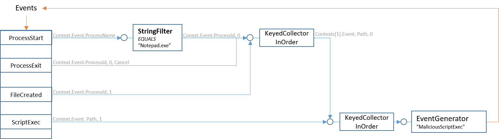
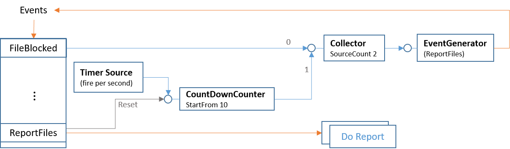
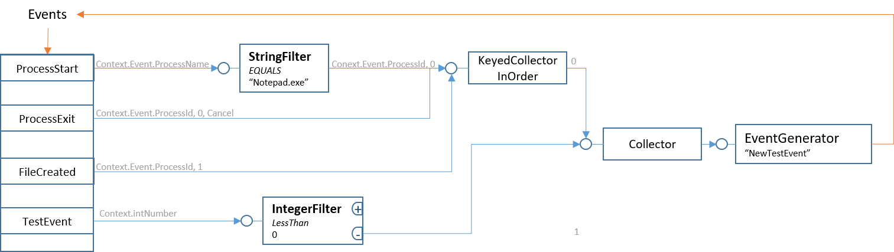
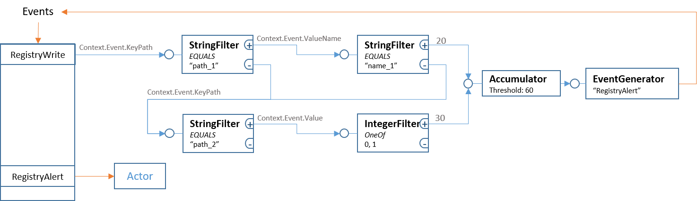

# Test Rules

## Rule of Test 1:

*If "**notepad.exe**"created one file and later the file is executed as script, generate event  "**MaliciousScriptExec**"*

## Rule of Test 2 (The "Real Example" in README.md)

- *If there is new "**FileBlockec**" event and we did not report for 10 seconds, report right away*

- *If we've already reported recently, hold new "FileBlocked" events for 10 seconds to aggregate them*

- *Do not report if there no new "**FileBlocked**"*

## Rule of TestShare

*A fake rule to test primitive share. This rule has same `StringFilter` and `KeyedCollectorInOrder` as Test1 rule, they should share these 2 primitives when added one by one.*

*Also test the "**SignalOnNegative**", which is the base to implement **NOT** and **OR**.*

## Rule of TestAccumulator

*A fake rule to test primitive `Accumulator`, also demo the **OR** logic.*

*On "**RegistryWrite**" event, if key path equals "**path_1**" and value name equals "**name_1**", give it score 20; if key path equals "**path_2**" and value equals 0 or 1, give it score 30. Generate event "**RegistryAlert**" when accumulated score exceed 60.*

